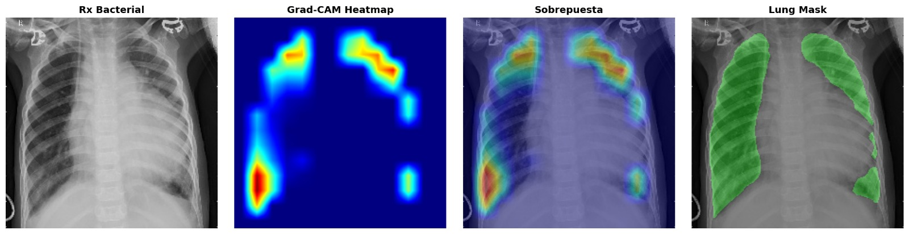
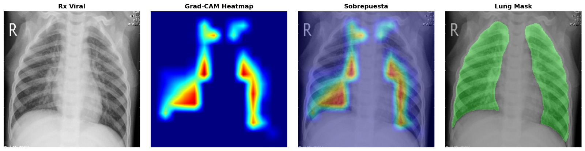
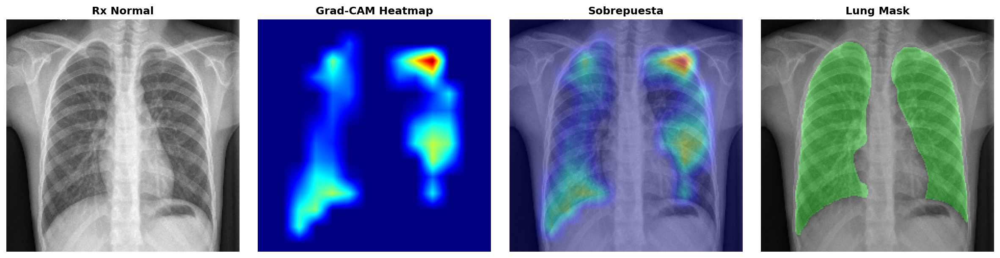

<!-- Badges -->
[](https://github.com/quirogaez/capstone/actions)
[](https://dvc.org)
[]()

# 🧠 Capstone Project – Detección Inteligente de Neumonía en Radiografías de Tórax

> **Propuesta SIC 2024**  
> *“Aplicando CNNs preentrenadas y generación adversarial para asistir el diagnóstico médico”*

---

## 🩺 Descripción general

Este proyecto desarrolla un sistema de inteligencia artificial para la detección automatizada de neumonía en radiografías de tórax pediátricas. El enfoque combina redes neuronales convolucionales (CNN) preentrenadas con técnicas avanzadas de procesamiento de imágenes y generación de datos sintéticos.

Se implementa un modelo basado en **VGG16 con fine-tuning**, acompañado del uso de **DCGANs** para mitigar el desbalance entre clases, mejorando así la capacidad de generalización del sistema. Adicionalmente, se integran visualizaciones **Grad-CAM** para aportar interpretabilidad clínica al modelo, facilitando su posible adopción en contextos reales.

El proyecto también se inspira en propuestas recientes de clasificación multiclase aplicadas a imágenes médicas, como las presentadas en trabajos recientes disponibles en [**MDPI**](https://www.mdpi.com/2073-8994/12/4/651), lo cual refuerza su enfoque basado en el estado del arte.

### 🔍 Objetivo general

Construir un modelo de inteligencia artificial mediante una red neuronal convolucional (CNN) preentrenada que permita clasificar imágenes de tórax en tres categorías clínicas (neumonía bacteriana, neumonía viral y casos normales) y resaltar las zonas anatómicas más relevantes para cada predicción, con el fin de apoyar el diagnóstico médico de forma precisa e interpretable.

---

## ⚙️ Características Clave del Modelo

- ✅ Clasificación multiclase: Neumonía bacteriana, neumonía viral y casos normales.
- 🧠 Arquitectura final: **VGG16** con pesos preentrenados y cabeza personalizada.
- 🔄 Balanceo de clases con **GANs**, logrando uniformidad de clases y mejor generalización.
- 🔍 **Grad-CAM** como herramienta de interpretabilidad visual, aplicada a predicciones clínicas.
- 📊 Resultados sólidos: Accuracy del 87.18% y F1-scores > 80% en todas las clases.

---

## 🗂️ Estructura del repositorio

| Ruta                        | Descripción                                                                                   |
|----------------------------|-----------------------------------------------------------------------------------------------|
| `notebooks/`               | Notebooks principales (EDA, entrenamiento, evaluación, GANs)                                 |
| `data/raw/`                | Radiografías originales del dataset de Kaggle                                                 |
| `data/processed/`          | Imágenes segmentadas, normalizadas y aumentadas                                              |
| `src/data/`                | Scripts de carga, segmentación y transformación                                               |
| `src/models/`              | Definición de modelos CNN, fine-tuning                                                        |
| `src/evaluation/`          | Funciones de métricas, gráficos y análisis                                                    |
| `experiments/`             | Configs de entrenamiento (YAML) y logs                                                        |
| `models/`                  | Pesos y artefactos generados por los modelos entrenados                                       |
| `logs/`                    | Logs generados por DVC y ejecución del pipeline                                               |
| `reports/`                 | Informes y presentaciones técnicas                                                            |
| `tests/`                   | Pruebas unitarias de componentes                                                              |
| `.github/workflows/`       | Pipeline de CI con validación automática                                                      |
| `dvc.yaml` / `.dvc/`       | Pipeline de datos y modelos con [DVC](https://dvc.org)                                         |
| `requirements.txt`         | Dependencias del entorno                                                                      |
| `README.md`                | Este archivo                                                                                  |

---

## 🔁 Flujo de Trabajo del Proyecto

1. **Carga y exploración de datos**: Se importan imágenes del dataset Chest X-ray (Pneumonia) y se realiza inspección visual, verificación de integridad y preprocesamiento.
2. **Preprocesamiento**: Redimensionamiento a 224x224, normalización, y estructuración del conjunto en carpetas `train/`, `val/`, y `test/`.
3. **Balanceo de clases**:
   - Se implementaron técnicas de **undersampling** y **data augmentation** inicialmente.
   - En el enfoque final, se entrenó un modelo **DCGAN** para generar imágenes sintéticas de clases minoritarias y lograr equilibrio (2530 imágenes por clase).
4. **Entrenamiento del modelo**:
   - Se utilizó **VGG16 preentrenado** sobre ImageNet.
   - Entrenamiento en dos fases: congelamiento de capas base + fine-tuning.
5. **Evaluación**:
   - Se utilizó accuracy, precision, recall y F1-score, tanto global como por clase.
   - Se generó una matriz de confusión para analizar errores.
6. **Interpretabilidad con Grad-CAM**:
   - Se aplicó Grad-CAM para resaltar regiones pulmonares relevantes.
   - Las visualizaciones se superpusieron sobre la imagen original para facilitar su interpretación clínica. 

---

## 📊 Resultados Finales

| Clase               | Precision | Recall | F1-Score |
|--------------------|-----------|--------|----------|
| Normal             | 94.90%    | 79.49% | 86.51%   |
| Neumonía Bacteriana| 87.31%    | 96.69% | 91.76%   |
| Neumonía Viral     | 77.50%    | 83.78% | 80.52%   |
| **Promedio Macro** | 86.57%    | 86.66% | 82.27%   |
| **Accuracy total** |           |        | **87.18%** |

---

## 🖼️ Visualizaciones con Grad-CAM

| Clase               | Imagen |
|--------------------|--------|
| Neumonía Bacteriana|  |
| Neumonía Viral     |  |
| Normal             |  |

---

## 📌 Dataset

- Fuente: [Chest X-ray Pneumonia Dataset – Kaggle](https://www.kaggle.com/datasets/paultimothymooney/chest-xray-pneumonia/data)  
- Tipo: Radiografías pediátricas clasificadas en **Normal**, **Neumonía Viral**, **Neumonía Bacteriana**

---
## 📦 Instalación rápida

<details>
<summary>🖥️ Opción A — Instalación local (CPU / GPU)</summary>

```bash
# 1) Clonar el repositorio
git clone https://github.com/quirogaez/capstone.git
cd capstone

# 2) Crear entorno virtual (opcional)
python -m venv .venv && source .venv/bin/activate

# 3) Instalar dependencias
pip install -r requirements.txt
```

</details>

<details>
<summary>🚀 Opción B — Docker Compose + GPU (recomendado)</summary>

**Requisitos previos**

- Docker ≥ 24 (con `docker compose`)
- Driver NVIDIA ≥ 535
- `nvidia‑container‑toolkit` instalado ✅
- GPU compatible con **CUDA 11.8 / cuDNN 8.6** (imagen `tensorflow/tensorflow:2.12.0-gpu`)

```bash
# Iniciar contenedor con JupyterLab y aceleración GPU
docker compose up -d tf-gpu
```

Abre tu navegador en <http://localhost:8888> para acceder a **JupyterLab**.

> El proyecto se monta en `/workspace` y el contenedor se limita a **14 CPUs** para no monopolizar recursos.

⚠️ Si tu GPU necesita otra combinación de CUDA/cuDNN (p. ej. RTX 40 Series con CUDA 12), cambia la imagen a `tensorflow/tensorflow:2.16.1-gpu` y ajusta versiones en `requirements.txt`.

</details>


